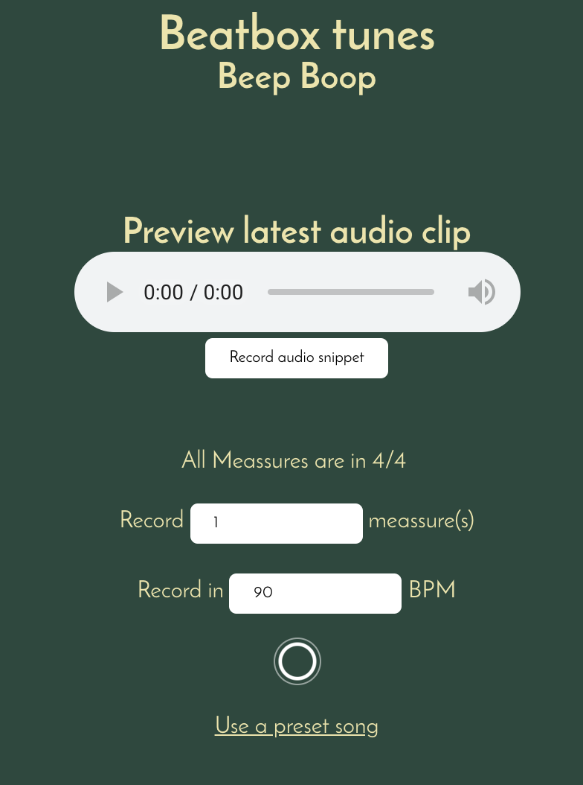

# Beatboxer

This app allowes the user to beatbox to music.
The app is built up in layers to provide PE so that the core functionality is always usable.

No installation is needed. It runs straight out of the box.
[live demo](https://senpaizuri.github.io/browser-technologies-1819/assignment/)

This applet does not work in IE 8 and older since `audio` elements aren't supported in that version.

# Excercises

## EX 1.2

