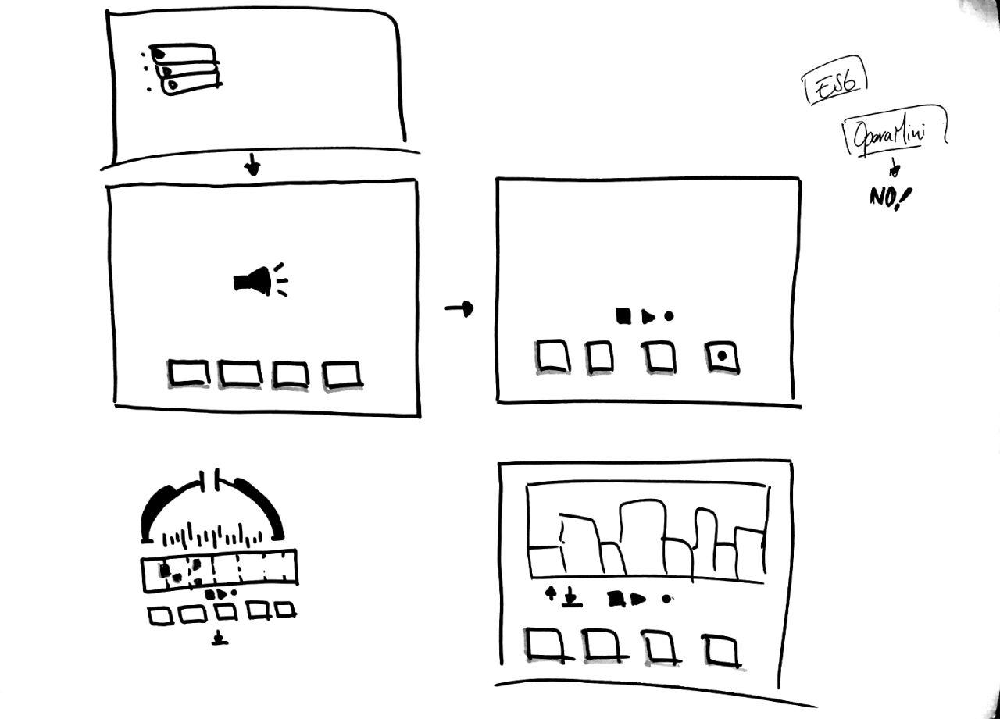
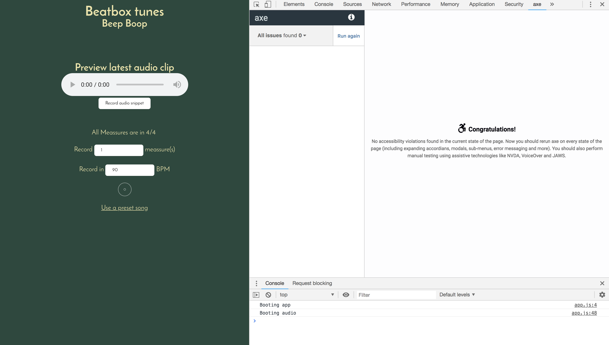
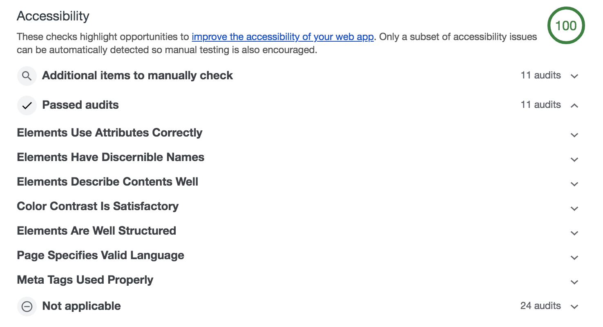
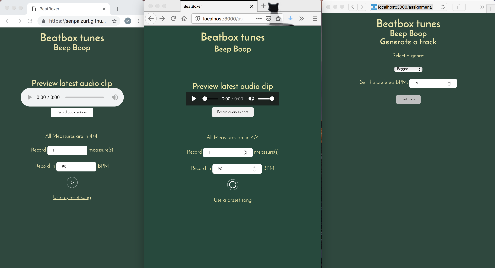
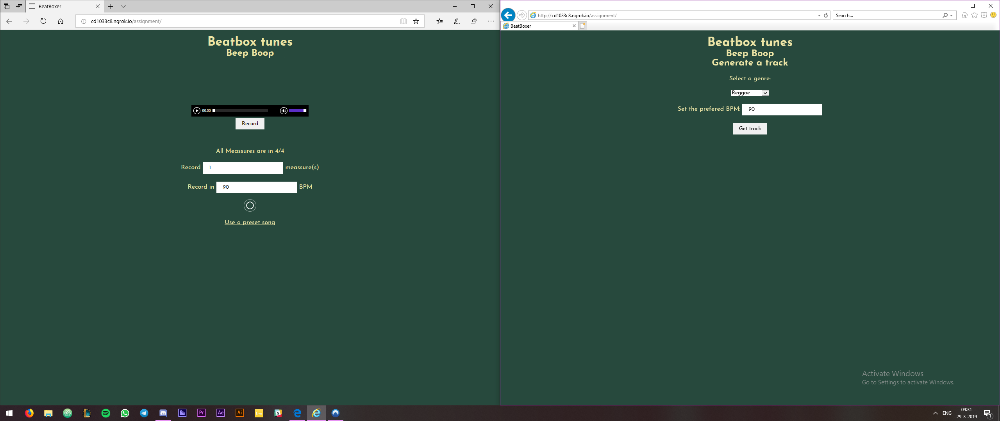

# Beatboxer

This app allowes the user to beatbox to music.
The app is built up in layers to provide PE so that the core functionality is always usable.

No installation is needed. It runs straight out of the box.
[live demo](https://senpaizuri.github.io/browser-technologies-1819/assignment/)

This applet does not work in IE 8 and older since `audio` elements aren't supported in that version.


# Excercises

## EX 1

The link to the project can be found [here](https://performancebois.herokuapp.com/)

### LocalStorage

To test local storage I actually tested with another app.
For this I used my app from WAFS which can be found [here](https://github.com/Senpaizuri/web-app-from-scratch-18-19/tree/master/week1)

This app heavily relies on the localstorage for data management and storing said data to serve the content faster.

To resolve this, if the local storage doens't work, you can just serve de data from the network. 
You can use something like this:
```javascript
try{
    const data = localStorage.getItem("user-data")
    return JSON.parse(data)
}catch(err){
    console.log(err)
    const data = data.get("API Link")
    return JSON.parse(data)
}
// Or
if("localStorage" in window){
    // get data
} else{
    // Fallback to network
}
```

This should try to get data from the local storage, if this fails it should fallback to the network and the could will work just fine.

### Custom fonts

Custom fonts are nice, no doubt. However, the thing is that some custom fonts take for ever to load and if the font fails to load it might not even show any content at all.

So in this app in [this](https://github.com/Senpaizuri/web-app-from-scratch-18-19/tree/master/week1) I used to use a font from the google fonts library. But slow load times made me wait for this font so no content would be shown until this was loaded.

CSS has a solution for this, `font-display:swap;`.
This uses the fallback font until the custom font is loaded. However this does mean that you are required to host the font yourself since you need to put this property on the `@font-face` then you define the font you're using.

## EX 2

For the final assement I chose to work on the beatbox.
This was my sketch to encompass the PE


The core would consist of the options of choosing a genre and BPM. A form would submit and give you preset tracks.

The enhancement would also bring custom audio snippets that the user can record and loop to make his/her own beats.

### Support

- Audio Element is for 96.35% supported. (IE9+)
- MP3 format is for 96.31% supported. (IE9+)
- Web Audio API is for 92.72% supported (No IE support)

The javascript contains feature detection, it will only render the enhancement layer if the Web audio api is supported since that is the newest prop that the app needs to work.

### Accesibility

This app passed all the Accesibility Test.

Axe plugin:


Chrome Audit:


### Cross Browser

Chrome, Firefox, Safari


They all support the web audio api. however safari seems to support a different spec.

[refference](https://caniuse.com/#search=audio%20context)

Edge, IE11



IE11 is the odd one out in my tests. This one didn't support the web audio api at all. So the fallback "kicks in" and still serves the core to the user.